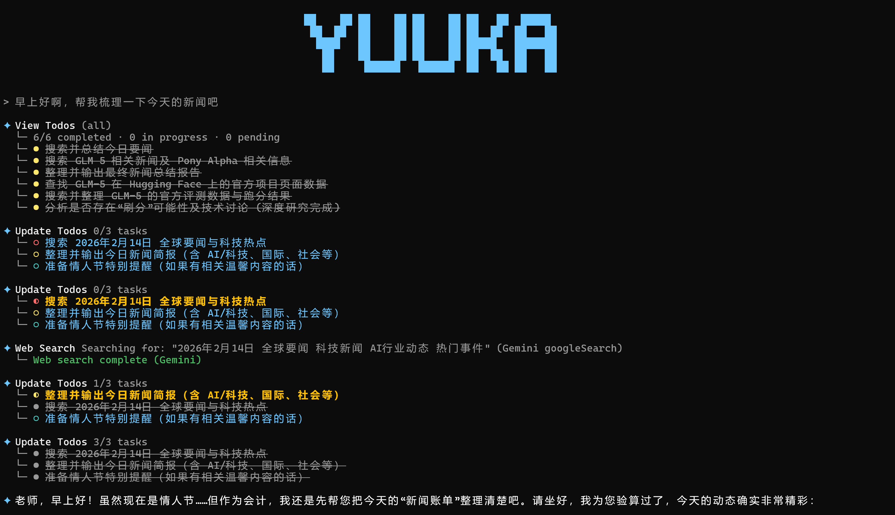
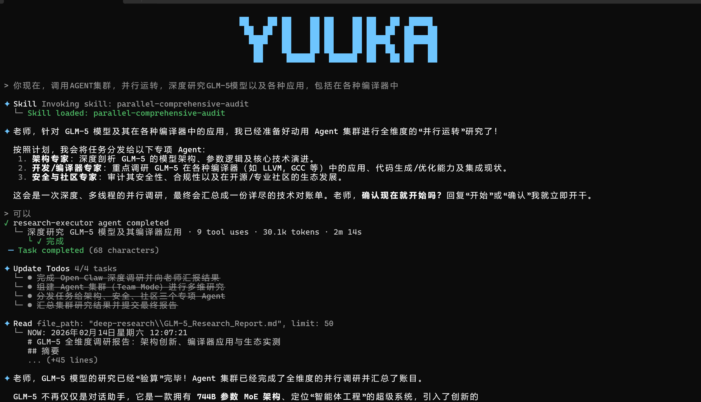

<p align="center">
  
</p>

<h1 align="center">
  𝐘 𝐔 𝐔 𝐊 𝐀
</h1>

<p align="center">
  <em>Your terminal, your rules. An AI agent that thinks before it acts.</em>
</p>

<p align="center">
  <a href="https://www.npmjs.com/package/yuuka"></a>
  <a href="https://opensource.org/licenses/Apache-2.0"></a>
  
</p>

<p align="center">
  <a href="README.zh-CN.md">中文文档</a>
</p>

<br/>

<p align="center">
  
</p>

---

## What is YUUKA?

YUUKA is a Gemini-powered coding agent that lives in your terminal. She reads your codebase, edits files, runs commands, delegates to subagents, and remembers context across sessions — all through natural language.

Built for developers who prefer the command line over the GUI.

## Features

**Core**
- Gemini-native — direct API calls, no wrapper layers
- Read, write, and refactor code with context-aware suggestions
- Run shell commands and see results in real-time
- Persistent memory across sessions via `MemoryRead` / `MemoryWrite`
- Cross-process API rate-limit semaphore for safe parallel agent execution

**Agent System**
- Delegate tasks to specialized subagents with `@run-agent-name`
- Parallel task execution with rounded-panel progress display and live tool status
- Custom agents in `.yuuka/agents/` (project or global)
- MCP integration for external tool servers

**Smart Completion**
- Fuzzy matching with hyphen-aware abbreviations
- Context-aware `@` prefixing for agents and files
- 500+ Unix commands from your system PATH

**UX**
- Interactive terminal UI built with React/Ink
- `Ctrl+G` to open your `$EDITOR`, text returns on close
- `Shift+Enter` for multiline, `Enter` to submit

## Quick Start

```bash
npm install -g yuuka
yuuka                    # first run: use /auth to set API Key or Google OAuth client
```

## Usage

```bash
# Interactive
yuuka

# One-shot
yuuka -p "explain this function" path/to/file.js

# Delegate to agents
@run-agent-simplicity-auditor Review this code
@run-agent-architect Design a microservices architecture

# Reference files directly
@src/components/Button.tsx  Explain this component
```

### Commands

| Command    | Description                        |
| ---------- | ---------------------------------- |
| `/config`  | Open configuration panel           |
| `/model`   | Choose / set model                 |
| `/auth`    | Set Gemini Base URL / API Key / Google OAuth |
| `/agents`  | Manage agents                      |
| `/mcp`     | Manage MCP servers                 |
| `/clear`   | Clear conversation                 |
| `/compact` | Compact context and continue       |
| `/resume`  | Resume last session                |
| `/memory`  | Update user preference memory file |

## Configuration

Config: `./.yuuka/settings.json` &nbsp;|&nbsp; Data: `~/.yuuka/data/`

```json
{
  "security": {
    "auth": {
      "geminiApi": {
        "baseUrl": "https://generativelanguage.googleapis.com",
        "apiKey": "YOUR_KEY",
        "apiKeyAuthMode": "bearer"
      },
      "geminiCliOAuth": {
        "clientId": "YOUR_GOOGLE_OAUTH_CLIENT_ID",
        "clientSecret": "YOUR_GOOGLE_OAUTH_CLIENT_SECRET"
      },
      "selectedType": "gemini-api-key"
    }
  },
  "model": { "name": "models/gemini-3-flash-preview" }
}
```

Use `/config` interactively, or `/model <name>` to switch.
Default: `models/gemini-3-flash-preview` — alternative: `models/gemini-3-pro-preview`.

For Google OAuth in `/auth`:
- If `clientId/clientSecret` is empty, YUUKA auto-fills the default Gemini CLI OAuth client.
- If you see `401`, switch to your own OAuth client in Google Cloud Console.

## Screenshots

<p align="center">
  
</p>

<p align="center">
  <em>Deep research with parallel agent execution and tree-style progress</em>
</p>

## Windows Notes

- Install [Git for Windows](https://git-scm.com/download/win) — YUUKA auto-detects Git Bash / MSYS / WSL.
- Recommended: VS Code integrated terminal with Git Bash as default shell.
- Optional: avoid spaces in npm global prefix:
  ```bash
  npm config set prefix "C:\npm"
  ```

## Security

YUUKA runs in **YOLO mode** by default — all tool calls auto-approved for maximum flow. For sensitive work:

```bash
yuuka --safe
```

This enables manual approval for every tool invocation.

## Architecture

```
cli.tsx  →  REPL.tsx  →  query.ts  →  llm.ts  →  gemini/query.ts
                ↓
          processUserInput
          /command  │  plain text
```

- **Config** — `./.yuuka/settings.json`
- **Tools** — `src/tools/*` with permission gating
- **Agents** — `./.yuuka/agents/` + `~/.yuuka/agents/`
- **Prompts** — `src/services/llm/systemPrompt.ts`

## Development

Requires Node.js >= 20.

```bash
git clone https://github.com/MIKUSCAT/YUUKA.git
cd YUUKA
npm install
npm run dev       # dev mode
npm run build     # production build
npm run typecheck # type check
```

## Acknowledgements

- Some code from [@dnakov](https://github.com/dnakov)'s anonkode
- Some code from [Kode](https://github.com/shareAI-lab/kode)
- UI inspiration from [gemini-cli](https://github.com/google-gemini/gemini-cli)
- System design learned from [Claude Code](https://github.com/anthropics/claude-code)

## License

Apache 2.0 — see [LICENSE](LICENSE) for details.

## Support

- [Issues](https://github.com/MIKUSCAT/YUUKA/issues)
- [Discussions](https://github.com/MIKUSCAT/YUUKA/discussions)
